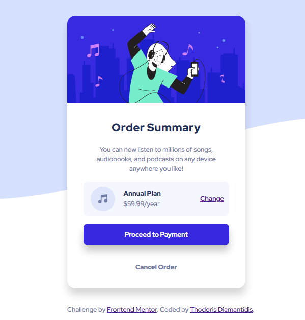
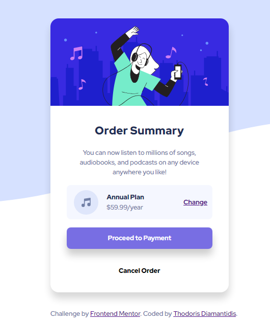

# Frontend Mentor - Order summary card solution

This is a solution to the [Order summary card challenge on Frontend Mentor](https://www.frontendmentor.io/challenges/order-summary-component-QlPmajDUj). Frontend Mentor challenges help you improve your coding skills by building realistic projects.

Here is the live site
Solution URL: [Order-summary](https://order-summary-frontendmentorio.netlify.app/)

## Table of contents

- [Overview](#overview)
  - [The challenge](#the-challenge)
  - [Screenshot](#screenshot)
  - [Links](#links)
- [My process](#my-process)
  - [Built with](#built-with)
  - [What I learned](#what-i-learned)
  - [Continued development](#continued-development)
  - [Useful resources](#useful-resources)
- [Author](#author)
- [Acknowledgments](#acknowledgments)

## Overview

This was overall a fun challenge to tackle

### The challenge

Users should be able to:

- See hover states for interactive elements

### Screenshot

## Links

- Live Site URL: [Order-summary](https://order-summary-frontendmentorio.netlify.app/)

## My process

My proccess for this project is almost the same as any project that i start:

- First step was to define my html structure and make a starter CSS file so it will be easier later on to style the whole project
- Started of with adding a CSS resseter from (https://www.joshwcomeau.com/css/custom-css-reset/)
- Added some Custom variables to help me in this project(guided by the style-guide.md)
- Second step was to start styling for mobile-first
- Started styling untill i was happy with the result
- Went and did the responsiveness afterwards
- Third and last step was to perfect the styling

### Built with

- Semantic HTML5 markup
- CSS custom properties
- Flexbox
- CSS Grid
- Mobile-first workflow

### Continued development

As always i love learning new thing and im up for any challenge!

### Useful resources

- [CSS Reset](https://www.joshwcomeau.com/css/custom-css-reset/) - This helped me a ton by starting of my Css file on the right foot. I really liked this pattern and will use it going forward.

## Author

- Website - [Thodoris Diamantidis](https://thodoris-diamantidis-portfolio.netlify.app/)
- Frontend Mentor - [@Thodoris-Diamantidis](https://www.frontendmentor.io/profile/Thodoris-Diamantidis)
